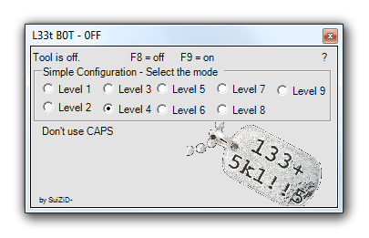

# L33t B0T
# Transform your basic Keyboard Input to LeetSpeak!
# s74y c001 

 - Download LeetBot.exe
 - Start with F9, Stop with F8
 


 - PS: Feel free to add your own level and push to this repo !
 
 # Change MainForm.cs, compile and commit!
 ```
 string [] alphabet = {"a", "b", "c", "d", "e", "f", "g", "h", "i", "j", "k", "l", "m", "n", "o", "p", "q", "r", "s", "t", "u", "v", "w", "x", "y", "z"};
        string [] level1   = {"4", "b", "c", "d", "3", "f", "g", "h", "i", "j", "k", "1", "m", "n", "0", "p", "9", "r", "s", "7", "u", "v", "w", "x", "y", "z"};
        string [] level2   = {"4", "b", "c", "d", "3", "f", "g", "h", "1", "j", "k", "1", "m", "n", "0", "p", "9", "r", "5", "7", "u", "v", "w", "x", "y", "2"};
        string [] level3   = {"4", "8", "c", "d", "3", "f", "6", "h", "'", "j", "k", "1", "m", "n", "0", "p", "9", "r", "5", "7", "u", "v", "w", "x", "'/", "2"};
        string [] level4   = {"@", "8", "c", "d", "3", "f", "6", "h", "'", "j", "k", "1", "m", "n", "0", "p", "9", "r", "5", "7", "u", "v", "w", "x", "'/", "2"};
        string [] level5   = {"@", "|3", "c", "d", "3", "f", "6", "#", "!", "7", "|<", "1", "m", "n", "0", "|>", "9", "|2", "$", "7", "u", "\\/", "w", "x", "'/", "2"};
        string [] level6   = {"@", "|3", "c", "|)", "&", "|=", "6", "#", "!", ",|", "|<", "1", "m", "n", "0", "|>", "9", "|2", "$", "7", "u", "\\/", "w", "x", "'/", "2"};
        string [] level7   = {"@", "|3", "[", "|)", "&", "|=", "6", "#", "!", ",|", "|<", "1", "^^", "^/", "0", "|*", "9", "|2", "5", "7", "(_)", "\\/", "\\/\\/", "><", "'/", "2"};
        string [] level8   = {"@", "8", "(", "|)", "&", "|=", "6", "|-|", "!", "_|", "|\\(", "1", "|\\/|", "|\\|", "()", "|>", "(,)", "|2", "$", "|", "|_|", "\\/", "\\^/", ")(", "'/", "\"/_"};
        string [] level9   = {"@", "8", "(", "|)", "&", "|=", "6", "|-|", "!", "_|", "|\\}{", "|_", "/\\/\\", "|\\|", "()", "|>", "(,)", "|2", "$", "|", "|_|", "\\/", "\\^/", ")(", "'/", "\"/_"};
		
	```